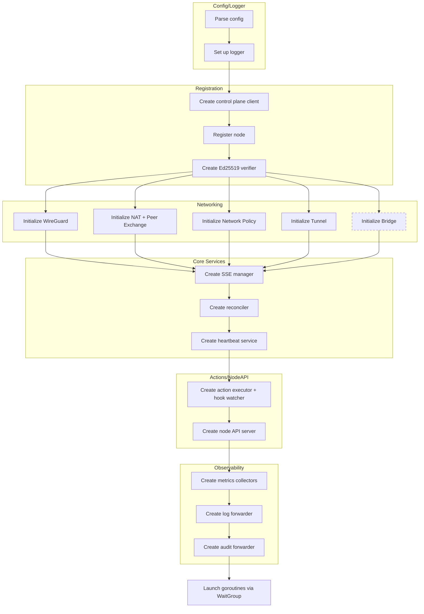
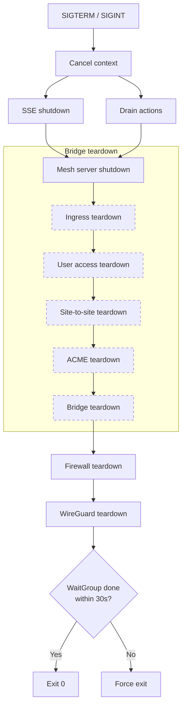

# Agent Internals

## Subsystems

These subsystems are initialized and started by `plexd up`:

| Subsystem | Package | Reference |
|-----------|---------|-----------|
| Control Plane Client | `internal/api` | [Control Plane Client](reference/core/control-plane-client.md) |
| Registration | `internal/registration` | [Registration](reference/core/registration.md) |
| Event Verification | `internal/api` (Ed25519Verifier) | [Event Verification](reference/core/event-verification.md) |
| WireGuard | `internal/wireguard` | [WireGuard Tunnel Management](reference/networking/wireguard.md) |
| NAT Traversal | `internal/nat` | [NAT Traversal via STUN](reference/networking/nat-traversal.md) |
| Peer Exchange | `internal/peerexchange` | [Peer Endpoint Exchange](reference/networking/peer-endpoint-exchange.md) |
| Network Policy | `internal/policy` | [Network Policy Enforcement](reference/networking/network-policy.md) |
| Secure Tunneling | `internal/tunnel` | [Secure Access Tunneling](reference/networking/secure-access-tunneling.md) |
| SSE Manager | `internal/api` (SSEManager) | [Control Plane Client](reference/core/control-plane-client.md) |
| Reconciler | `internal/reconcile` | [Configuration Reconciliation](reference/core/reconciliation.md) |
| Heartbeat | `internal/agent` (HeartbeatService) | [Heartbeat Service](reference/core/heartbeat-service.md) |
| Integrity | `internal/integrity` | [Integrity Verification](reference/actions/integrity-verification.md) |
| Actions | `internal/actions` | [Remote Actions and Hooks](reference/actions/remote-actions-hooks.md) |
| Node API | `internal/nodeapi` | [Local Node API](reference/core/nodeapi.md) |
| Metrics | `internal/metrics` | [Metrics Collection & Reporting](reference/observability/metrics-collection.md) |
| Log Forwarding | `internal/logfwd` | [Log Forwarding](reference/observability/log-forwarding.md) |
| Audit Forwarding | `internal/auditfwd` | [Audit Forwarding](reference/observability/audit-forwarding.md) |
| Bridge (bridge mode) | `internal/bridge` | [Bridge Mode](reference/bridge/bridge-mode.md) |

## Startup Sequence (`plexd up`)

The `runUp` function in `cmd/plexd/cmd/up.go` performs initialization before entering steady state:

**Initialization:**

1. **Parse config** — read YAML, apply CLI flag overrides, apply `PLEXD_*` env overrides
2. **Set up logger** — structured `slog` logger with configured level
3. **Create control plane client** — `api.NewControlPlane()` with API config and build version
4. **Register** — `registrar.Register()` loads or creates node identity (fatal on failure)
5. **Create Ed25519 verifier** — decode the control plane's signing public key from identity
5a. **Initialize WireGuard** — create WireGuard interface, configure address and MTU, bring interface up
5b. **Initialize NAT + Peer Exchange** — create STUN client, NAT discoverer, and peer exchanger
5c. **Initialize Network Policy** — create policy engine, firewall controller, and enforcer
5d. **Initialize Tunnel** — load/generate host key, create JWT verifier and mesh server
5e. **Initialize Bridge** (bridge mode only) — create bridge manager, ACME, ingress, user access, site-to-site managers; run Setup on each
6. **Create SSE manager** — `api.NewSSEManager()` with handlers for signing key rotation, WireGuard peer events, tunnel events, policy events, and bridge events (bridge mode)
7. **Create reconciler** — `reconcile.NewReconciler()` with handlers for WireGuard, policy, and bridge reconciliation
8. **Create heartbeat service** — `agent.NewHeartbeatService()` with subsystem status enrichment, auth-failure callback, and key-rotation callback
9. **Create integrity store + verifier** — `integrity.NewStore()` and `integrity.NewVerifier()` for hook checksums
10. **Create action executor** — `actions.NewExecutor()`, register 11 built-in actions, register `action_request` SSE handler, report capabilities to control plane
11. **Create hook watcher** — `actions.NewHookWatcher()` for filesystem hook scanning
12. **Create node API server** — `nodeapi.NewServer()`, wire action provider, hook reloader, and reconcile handler
13. **Create metrics collectors + manager** — system collector, agent stats collector, `metrics.NewManager()`
14. **Create log sources + forwarder** — journald source, file sources from `file_patterns`, `logfwd.NewForwarder()`
15. **Create audit sources + forwarder** — process source, `auditfwd.NewForwarder()`

**Goroutines (10 in node mode, 11 in bridge mode):**

After initialization, goroutines are started via a `sync.WaitGroup`:

1. **SSE Manager** — `sseMgr.Start()` — event stream connection
2. **Heartbeat** — `heartbeat.Run()` — periodic heartbeats
3. **Reconciler** — `reconciler.Run()` — periodic state reconciliation
4. **Node API** — `nodeAPISrv.Start()` — Unix socket + optional HTTP server
5. **Hook Watcher** — `hookWatcher.Watch()` — filesystem watching for hook changes
6. **Metrics Manager** — `metricsMgr.Run()` — collect and report metrics
7. **Log Forwarder** — `logForwarder.Run()` — collect and forward logs
8. **Audit Forwarder** — `auditForwarder.Run()` — collect and forward audit events
9. **Peer Exchange** — `exchanger.Run()` — STUN discovery and endpoint exchange loop
10. **Mesh Server** — `meshServer.Start()` — tunnel SSH server
11. **Bridge Relay** (bridge mode only) — `bridgeMgr.StartRelay()` — UDP relay listener

## Shutdown Sequence

On SIGTERM or SIGINT:

1. **Context cancel** — the signal-notify context is cancelled, which signals all goroutines to stop
2. **`sseMgr.Shutdown()`** — close the SSE connection
3. **`executor.Shutdown()`** — drain running actions
4. **`meshServer.Shutdown()`** — stop tunnel SSH server and drain sessions
5. **`ingressMgr.Teardown()`** — close ingress listeners (bridge mode)
6. **`userAccessMgr.Teardown()`** — remove user access peers and interface (bridge mode)
7. **`s2sMgr.Teardown()`** — remove site-to-site tunnels and interfaces (bridge mode)
8. **`acmeMgr.Teardown()`** — stop ACME certificate management (bridge mode)
9. **`bridgeMgr.Teardown()`** — remove bridge routes and forwarding (bridge mode)
10. **`enforcer.Teardown()`** — remove firewall chains and rules
11. **`wgMgr.Teardown()`** — delete WireGuard interface (last, others depend on it)
12. **`wg.Wait()` with 30s timeout** — wait for all goroutines to exit; force exit if timeout exceeded

## Authentication Flow

1. **Bootstrap** — node registers using a bootstrap token (file, env var, or metadata service)
2. **Node Secret Key** — registration returns a `NodeSecretKey` used for all subsequent API authentication
3. **Heartbeat Auth** — each heartbeat uses the node secret key; on 401 Unauthorized, the `onAuthFailure` callback triggers re-registration
4. **Key Rotation** — on `signing_key_rotated` SSE events or heartbeat `RotateKeys` flag, the Ed25519 verifier keys are updated

## SSE Event Types

The SSE manager processes these event types:

| Event | Handler | Description |
|-------|---------|-------------|
| `signing_key_rotated` | Updates Ed25519 verifier keys | Fired when the control plane rotates its signing key pair |
| `action_request` | Dispatches to action executor | Requests execution of a built-in action or hook |
| `peer_added` | `wireguard.HandlePeerAdded` | Adds a new WireGuard peer |
| `peer_removed` | `wireguard.HandlePeerRemoved` | Removes a WireGuard peer |
| `peer_key_rotated` | `wireguard.HandlePeerKeyRotated` | Rotates a peer's public key |
| `peer_endpoint_changed` | `wireguard.HandlePeerEndpointChanged` | Updates a peer's endpoint (via peer exchange) |
| `policy_updated` | `policy.HandlePolicyUpdated` | Triggers policy reconciliation |
| `ssh_session_setup` | `tunnel.HandleSSHSessionSetup` | Creates a new tunnel session |
| `session_revoked` | `tunnel.HandleSessionRevoked` | Closes a revoked tunnel session |
| `bridge_config_updated` | `bridge.HandleBridgeConfigUpdated` | Triggers bridge reconciliation (bridge mode) |
| `relay_session_assigned` | `bridge.HandleRelaySessionAssigned` | Assigns a relay session (bridge mode) |
| `relay_session_revoked` | `bridge.HandleRelaySessionRevoked` | Revokes a relay session (bridge mode) |
| `ingress_rule_assigned` | `bridge.HandleIngressRuleAssigned` | Assigns an ingress rule (bridge mode) |
| `ingress_rule_revoked` | `bridge.HandleIngressRuleRevoked` | Revokes an ingress rule (bridge mode) |
| `ingress_config_updated` | `bridge.HandleIngressConfigUpdated` | Triggers ingress reconciliation (bridge mode) |
| `user_access_peer_assigned` | `bridge.HandleUserAccessPeerAssigned` | Assigns a user access peer (bridge mode) |
| `user_access_peer_revoked` | `bridge.HandleUserAccessPeerRevoked` | Revokes a user access peer (bridge mode) |
| `user_access_config_updated` | `bridge.HandleUserAccessConfigUpdated` | Triggers user access reconciliation (bridge mode) |
| `site_to_site_tunnel_assigned` | `bridge.HandleSiteToSiteTunnelAssigned` | Assigns a site-to-site tunnel (bridge mode) |
| `site_to_site_tunnel_revoked` | `bridge.HandleSiteToSiteTunnelRevoked` | Revokes a site-to-site tunnel (bridge mode) |
| `site_to_site_config_updated` | `bridge.HandleSiteToSiteConfigUpdated` | Triggers site-to-site reconciliation (bridge mode) |

## See Also

- [Architecture & Agent Lifecycle](guide/architecture.md) — High-level architecture, lifecycle diagrams, operational behavior
- [Configuration Reference](reference/core/configuration.md) — Full YAML configuration schema
- [CLI Reference](reference/core/cli.md) — Command-line interface and subcommands
- [Environment Variables Reference](reference/core/environment-variables.md) — All `PLEXD_*` overrides
