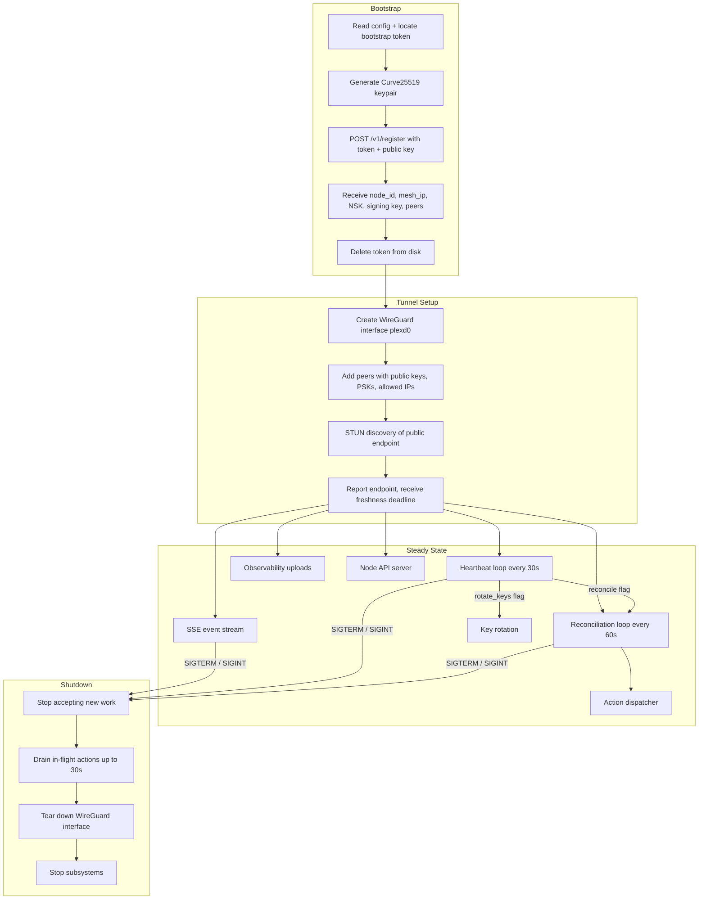
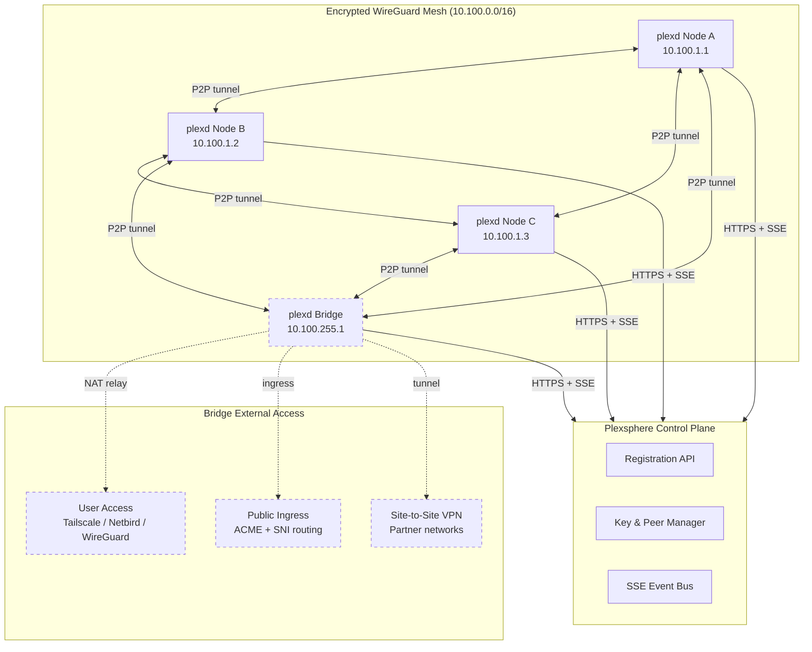
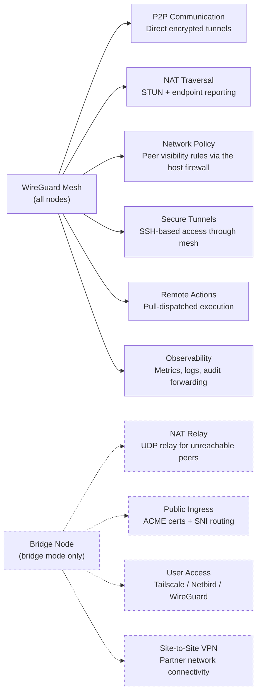

# Platform Communication & Mesh Networking

plexd communicates with the Plexsphere control plane through four outbound-only HTTPS channels: registration, SSE event streaming, heartbeat, and reconciliation. No inbound ports or public IPs are required on the node side.

Between nodes, plexd forms an encrypted WireGuard mesh for direct peer-to-peer traffic. The control plane coordinates key exchange and peer discovery but never sits in the data path — all mesh traffic flows directly between nodes.

## How plexd Communicates with Plexsphere

All communication is initiated by the node. The control plane never connects inbound to a node.

```mermaid
sequenceDiagram
    participant N as plexd (Node)
    participant CP as Plexsphere Control Plane

    rect rgb(240, 240, 240)
    Note over N,CP: 1. Registration (one-time)
    N->>N: Generate Curve25519 keypair
    N->>CP: POST /v1/register {token, public_key, hostname, capabilities}
    CP-->>N: {node_id, mesh_ip, signing_key, NSK, peers[]}
    N->>N: Delete bootstrap token from disk
    end

    rect rgb(240, 240, 240)
    Note over N,CP: 2. SSE Event Stream (persistent)
    N->>CP: GET /v1/nodes/{id}/events (SSE, Last-Event-ID)
    CP-->>N: Ed25519-signed event envelopes
    Note right of CP: node_state_updated, policy_updated,<br/>bridge_config_updated, rotate_keys,<br/>signing_key_rotated, ...
    end

    rect rgb(240, 240, 240)
    Note over N,CP: 3. Heartbeat (every 30s)
    N->>CP: POST /v1/nodes/{id}/heartbeat {client_now, binary_checksum, binary_version, nat_summary}
    CP-->>N: 200 OK (accepted_at; optional reconcile, rotate_keys flags)
    end

    rect rgb(240, 240, 240)
    Note over N,CP: 4. Reconciliation (every 60s)
    N->>CP: GET /v1/nodes/{id}/state
    CP-->>N: {peers, reachability, policy, bridge, state, reports}
    N->>N: Diff by presence and apply corrections
    end

    rect rgb(240, 240, 240)
    Note over N,CP: 5. Observability (periodic)
    N->>CP: POST /v1/nodes/{id}/metrics
    N->>CP: POST /v1/nodes/{id}/logs
    N->>CP: POST /v1/nodes/{id}/audit
    end
```

### Channel Summary

| Channel | Direction | Protocol | Frequency | Purpose |
|---------|-----------|----------|-----------|---------|
| Registration | Node → CP | HTTPS POST | Once | Bootstrap identity, receive keys and peers |
| SSE Stream | Node ← CP | HTTPS SSE | Persistent | Real-time peer, policy, action, and key events |
| Heartbeat | Node → CP | HTTPS POST | Every 30s | Liveness, status reporting, reconcile/rotate hints |
| Reconciliation | Node → CP | HTTPS GET | Every 60s | State consistency fallback; pulls the desired-state snapshot and the queued action dispatches |
| Observability | Node → CP | HTTPS POST | Periodic | Metrics, logs, and audit event uploads |

The SSE stream is the primary real-time channel. Reconciliation acts as a consistency fallback — if an SSE event is missed, the next reconciliation cycle detects and corrects the drift. Action dispatches are the one payload that never rides the event stream at all: they are delivered in the `executions` block of the reconciliation pull, and the matching `action_request` event merely pulls the next cycle forward. See [Heartbeat Service](/reference/core/heartbeat-service) and [Reconciliation](/reference/core/reconciliation) for protocol details.

## Node Lifecycle

A node progresses through four phases from first boot to shutdown.



See [Agent Lifecycle](/guide/agent-lifecycle) for the full startup sequence and shutdown details.

## The Encrypted Mesh Network

Nodes form a full-mesh WireGuard network in the `10.100.0.0/16` address space. Each node gets a unique `/32` mesh IP at registration. The control plane distributes public keys and pre-shared keys but never handles mesh traffic.



Key properties of the mesh:

- **Outbound-only** — nodes initiate all connections. No inbound ports required.
- **NAT traversal** — nodes behind NAT use STUN to discover their public endpoint and exchange it via the control plane. See [NAT Traversal](/reference/networking/nat-traversal).
- **Relay fallback** — when direct P2P is not possible, traffic is relayed through a bridge node. See [NAT Relay](/reference/bridge/nat-relay).
- **Per-peer PSKs** — each peer pair has a unique pre-shared key for post-quantum forward secrecy.
- **Network policy** — the control plane pushes visibility rules that control which peers can communicate. See [Network Policy](/reference/networking/network-policy).

## What the Mesh Enables



### Core Capabilities (all nodes)

| Capability | Description | Reference |
|------------|-------------|-----------|
| P2P Communication | Direct encrypted WireGuard tunnels between all peers | [WireGuard Tunnels](/reference/networking/wireguard) |
| NAT Traversal | STUN-based public endpoint discovery and exchange | [NAT Traversal](/reference/networking/nat-traversal) |
| Network Policy | Peer visibility rules enforced via the host firewall (nftables, pf or WFP) | [Network Policy](/reference/networking/network-policy) |
| Secure Tunnels | SSH-based access to services through the mesh | [Secure Access Tunneling](/reference/networking/secure-access-tunneling) |
| Remote Actions | Execute built-in and hook-based actions dispatched in the state pull | [Remote Actions & Hooks](/reference/actions/remote-actions-hooks) |
| Observability | Metrics, logs, and audit event forwarding | [Metrics](/reference/observability/metrics-collection), [Logs](/reference/observability/log-forwarding), [Audit](/reference/observability/audit-forwarding) |

### Bridge-Only Capabilities

| Capability | Description | Reference |
|------------|-------------|-----------|
| NAT Relay | UDP relay for peers that cannot establish direct P2P | [NAT Relay](/reference/bridge/nat-relay) |
| Public Ingress | ACME certificate management and SNI-based routing | [Public Ingress](/reference/bridge/public-ingress), [ACME & SNI](/reference/bridge/acme-sni) |
| User Access | Integration with Tailscale, Netbird, or standalone WireGuard | [User Access](/reference/bridge/user-access-integration) |
| Site-to-Site VPN | Connect partner or customer networks to the mesh | [Site-to-Site VPN](/reference/bridge/site-to-site-vpn) |

## See Also

- [Architecture](/guide/architecture) — detailed ASCII diagrams, platform support, mesh topology
- [Agent Lifecycle](/guide/agent-lifecycle) — full startup sequence, operational behavior, deregistration
- [Security & Trust Model](/guide/security) — key exchange, trust chain, threat model, network requirements
- [Agent Internals](/concepts) — subsystem overview, goroutine map, shutdown sequence
- [Control Plane Client](/reference/core/control-plane-client) — HTTP client implementation details
- [Registration](/reference/core/registration) — bootstrap authentication and identity persistence
