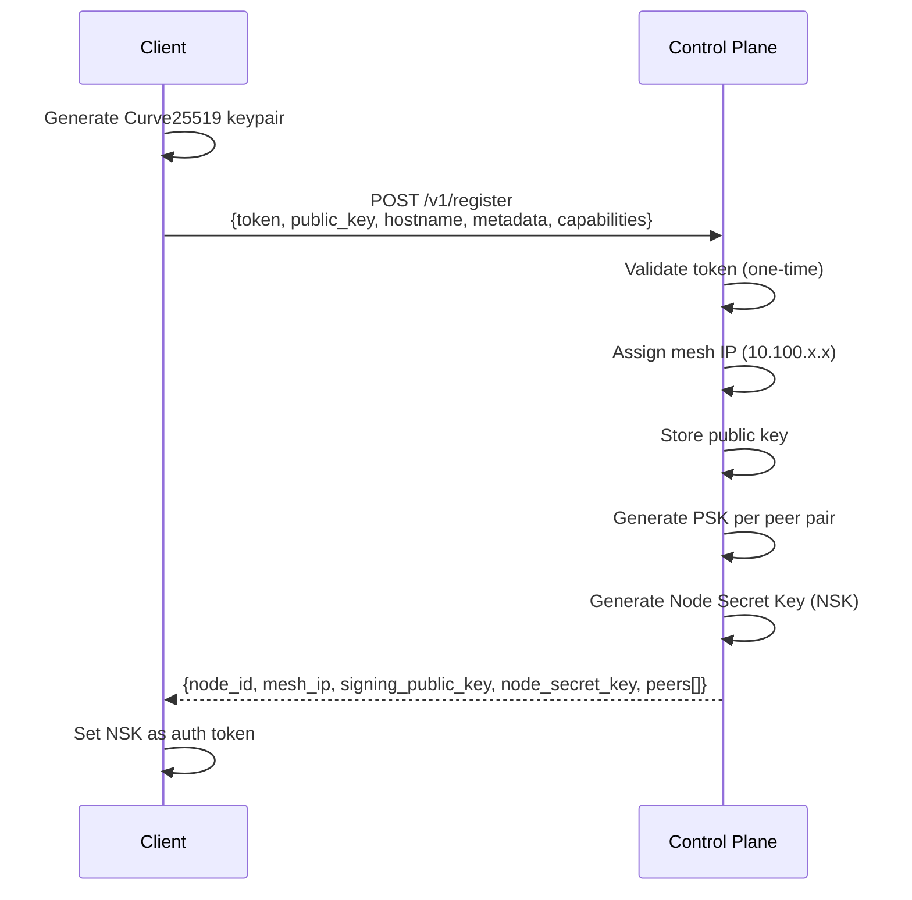
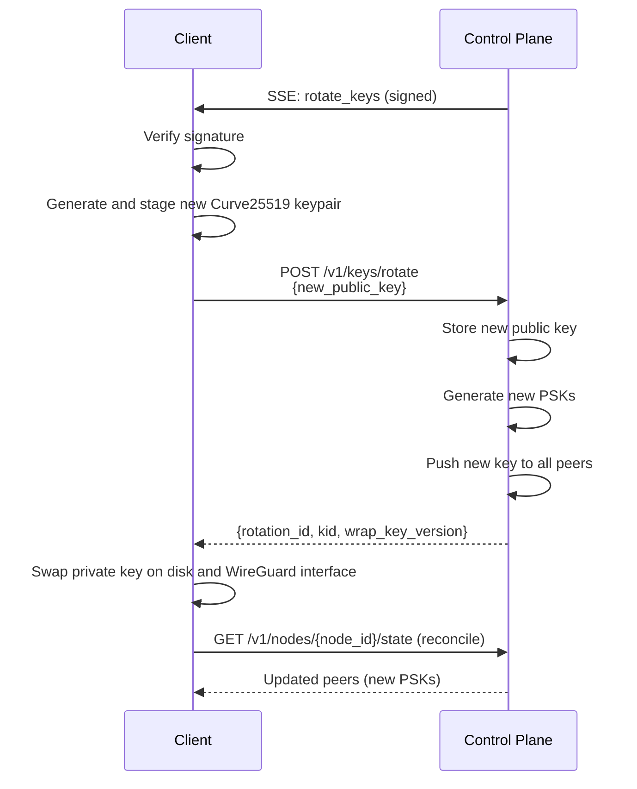
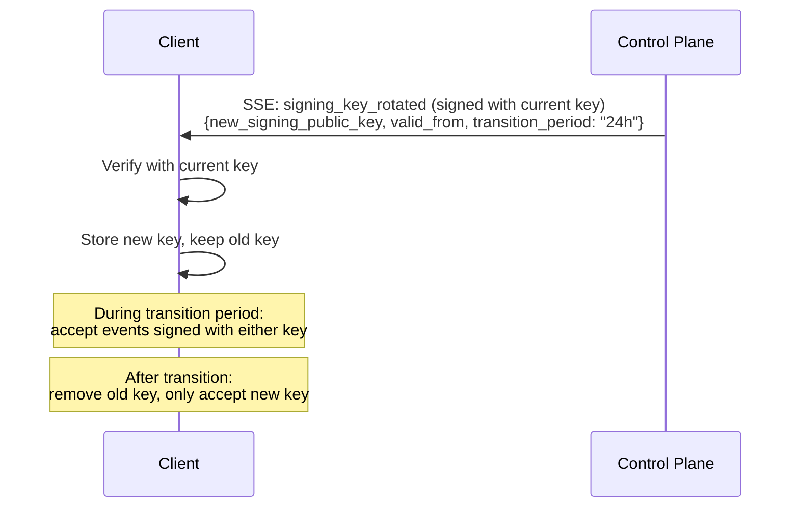

# Security & Trust Model

## Security Overview

- **Bootstrap tokens** are one-time-use with a short TTL. They are deleted from disk after successful registration.
- **Private keys** are generated during registration and stored in `/var/lib/plexd/`. They never leave the node.
- **Control plane communication** is TLS-encrypted (HTTPS). The agent validates the server certificate. Every SSE event is additionally signed with the control plane's Ed25519 key and verified by the agent before processing.
- **Mesh traffic** is encrypted end-to-end via WireGuard.
- **Compromised nodes** can be force-removed from the control plane, triggering key rotation across all affected peers.
- **Hook integrity** is enforced via SHA-256 checksums computed at discovery, monitored via inotify, and re-verified before every execution against the digest pinned at first discovery — there is no checksum on the wire, and the inotify watcher deliberately cannot move that pin. Mismatches block execution and trigger alerts.
- **Binary verification** - plexd reports its own SHA-256 checksum at registration and with every heartbeat. The control plane compares against known-good checksums per version.

## Key Exchange and Trust Model

plexd uses WireGuard's [Noise_IKpsk2](https://www.wireguard.com/protocol/) handshake with static Curve25519 key pairs. The control plane acts as a trusted key distribution center but never has access to private keys. All events from the control plane (peer changes, policy updates, action requests, key rotations) are signed with an Ed25519 signing key and verified by the agent before processing.

### Trust Chain

```
Bootstrap Token (one-time, short TTL)
        │
        ▼
   Control Plane  ──── Trust anchor: distributes public keys, PSKs,
        │               and its own Ed25519 signing public key
        │
        ├──► Signing Key ──── Verifies all SSE events + session JWTs
        │
        ▼
   Node Identity  ──── Public key bound to node ID and mesh IP
        │
        ▼
   Peer Tunnels   ──── WireGuard E2E encryption (private key stays local)
```

### Phase 1: Registration

During registration the node generates its Curve25519 key pair locally. Only the public key is sent to the control plane. The private key never leaves the node.



### Phase 2: Tunnel Setup

The client configures the local WireGuard interface using the registration response:

1. Create WireGuard interface (`plexd0`)
2. Assign mesh IP and set private key
3. Add each peer with its public key, endpoint, allowed IPs, and PSK
4. Run STUN discovery and report the node's public endpoint to the control plane
5. Receive NAT-discovered endpoints of peers and update WireGuard accordingly

### Phase 3: Steady State

The control plane pushes peer and key updates via SSE. Every SSE event is signed with the control plane's Ed25519 signing key. The client verifies the signature before applying any change.

**Signed Event Envelope:**

Every SSE event is wrapped in a signed envelope. The `signature` covers the canonical JSON serialization of all fields except `signature` itself (i.e. `id`, `type`, `scope`, `key_id`, `issued_at`, and `payload`):

```json
{
  "id": "evt_d4e5f6",
  "type": "node_state_updated",
  "scope": "node:n_abc123",
  "key_id": "did:web:plexsphere.com#key-2026-01",
  "issued_at": "2026-01-15T10:30:00Z",
  "payload": { "revision": 42 },
  "signature": "base64-encoded-ed25519-signature"
}
```

**Verification on every event:**

1. Select the signing key by the envelope's `key_id` — the current signing key, or the previous key during a rotation grace window — and verify the Ed25519 signature over the canonical JSON of all fields except `signature`, using the control plane's signing public key (received during registration).
2. Check `issued_at` staleness (max 5 minutes) and reject timestamps too far in the future.
3. If any check fails, reject the event and log it; the event is skipped and never dispatched.

This ensures that even if the TLS connection is compromised (e.g. through a rogue proxy or certificate authority), events cannot be forged. Duplicate or reordered deliveries are harmless because the reconciler's authoritative state pull, not the event payload, is the source of truth.

Action dispatch is the one case where that distinction cuts both ways. A dispatch is read only from the `executions` block of the NSK-authenticated state pull, so no event payload — forged, replayed, or reordered — can make a node run an action. But the state response itself carries **no** application-layer signature: unlike an SSE envelope, it is protected by TLS alone. An attacker able to present a certificate the node's system trust store accepts — a misissued certificate, a rogue CA, or a deployment that set `tls_insecure_skip_verify` — can therefore inject an `executions` entry naming any registered action. Signing the executions block is a control-plane contract change and is not yet available; until it is, treat the TLS trust path (and never enabling `tls_insecure_skip_verify` outside a lab) as the boundary that protects remote execution.

**SSE Events:**

| SSE Event | Client Action |
|---|---|
| `node_state_updated` | Trigger a state reconcile: refresh the local node state cache (metadata, data entries) and notify Node API consumers |
| `policy_updated` | Trigger a reconcile and update local firewall rules |
| `bridge_config_updated` | Trigger a bridge reconcile (bridge mode) |
| `peer_endpoint_changed` / `peer_key_rotated` | Trigger a state reconcile — peer topology is applied from the authoritative state pull, not the event payload |
| `action_request` | Trigger a state reconcile — the payload is opaque; action dispatches are delivered in the `executions` block of the authoritative state pull, never by the event (see [Remote Actions and Hooks](../reference/actions/remote-actions-hooks.md)) |
| `session_setup` | Trigger a state reconcile — the payload is opaque; the session is provisioned from the `sessions` block of the authoritative state pull, never from the event (see [Secure Access Tunneling](../reference/networking/secure-access-tunneling.md)) |
| `session_revoked` | Trigger a state reconcile — the payload is opaque; the session leaving the `sessions` block is what tears the listener down, so the reconcile's drain does the revocation |
| `rotate_keys` | Generate new Curve25519 keypair and initiate key rotation (see [Phase 4: Key Rotation](#phase-4-key-rotation)) |
| `signing_key_rotated` | Update the control plane's signing public key, selected by `key_id` (see [Signing Key Rotation](#signing-key-rotation)) |

### Phase 4: Key Rotation

Key rotation is triggered by the control plane - either on a schedule, by admin action, or in response to a compromised node. The `rotate_keys` signal arrives as a heartbeat flag or as a signed SSE event; the SSE event is verified before processing. The node stages a fresh keypair before submitting its public key, and the control plane replies with a rotation receipt (`rotation_id`, `kid`, `wrap_key_version`) rather than a peer list. The node swaps its private key only after that receipt, then picks up the new peers and PSKs on the next state pull. A repeated signal within five minutes of the last committed rotation is skipped, so a `rotate_keys` flag the control plane keeps set until it observes the new key cannot rekey the node on every heartbeat; a rotation whose key is already staged is always resubmitted.



When a node is force-removed from the control plane, all peers that had a tunnel to the compromised node receive a `peer_deregistered` event followed by fresh PSKs for their remaining peer pairs.

### Signing Key Rotation

The control plane's Ed25519 signing key (used for SSE event signatures and session JWTs) can be rotated independently of WireGuard mesh keys. During rotation, both the old and the new key are valid for a transition period.



The `signing_key_rotated` event is signed with the **current** (old) key, which the node already trusts. This creates a chain of trust - each key vouches for its successor.

### Pre-Shared Keys (PSK)

Each peer pair uses a unique PSK generated by the control plane and distributed to both peers. PSKs provide:

- **Post-quantum resistance:** An additional symmetric key layer on top of the Curve25519 ECDH, protecting against future quantum attacks on elliptic-curve cryptography.
- **Defense in depth:** Even if the Curve25519 key exchange is compromised, the PSK layer prevents decryption.

PSKs are rotated together with the main key pairs and whenever a peer is removed from the mesh.

## Threat Model

| Scenario | Impact | Mitigation |
|---|---|---|
| Control plane compromised | Attacker has signing key - can forge SSE events and inject malicious peers | PSK layer for mesh traffic; signing key rotation to limit exposure window; admin-side integrity monitoring; nodes log all applied events for forensic analysis |
| Node compromised | Attacker has private key and NSK of one node | Force-remove node, trigger key rotation + PSK refresh on all affected peers; rotate NSK to prevent decryption of future secrets; secrets are not cached so no plaintext on disk to exfiltrate |
| Bootstrap token stolen | Attacker could register a rogue node | One-time-use + short TTL limits the attack window |
| MITM during registration | Could intercept public key exchange and signing key | TLS + server certificate validation on all control plane communication |
| MITM on SSE stream | Could inject forged events (peer changes, action requests, key rotations) | Ed25519 signature verification on every event; TLS as first layer; forged events rejected without valid signature |
| Signing key compromised | Attacker can forge SSE events until key is rotated | Signing key rotation via `signing_key_rotated` event (signed with current key); transition period for graceful rollover |
| Session token stolen | Attacker could execute scoped actions on target node | Short TTL, node-bound, scoped action list, revocation on session end |
| Unauthorized local action execution | SSH user runs actions without permission | Requires valid session JWT; `--local` restricted to root and logged as emergency |
| Unauthorized secret access (local) | Attacker on node reads secrets via socket or K8s Secret | Socket requires `plexd-secrets` group; K8s Secrets contain only NSK-encrypted ciphertext; decryption requires plexd API with valid bearer token + live control plane |
| NSK compromised | Attacker could decrypt secret ciphertext from K8s Secrets or intercepted responses | NSK rotation invalidates old key; secrets are fetched in real-time so no historical ciphertext accumulates on-node; control plane re-encrypts with new NSK |

## Network Requirements

plexd requires the following network connectivity. All control plane communication is outbound-initiated from the node.

### Node Mode

| Direction | Protocol | Port | Destination | Purpose |
|---|---|---|---|---|
| Outbound | TCP/443 | - | Control plane API | Registration, heartbeat, observability, log/audit forwarding, callbacks |
| Outbound | TCP/443 | - | Control plane SSE | Real-time event stream (persistent connection) |
| Outbound | UDP/3478, UDP/19302 | - | STUN servers | NAT type discovery, public endpoint detection |
| Inbound/Outbound | UDP/51820 | 51820 | Mesh peers | WireGuard encrypted mesh traffic (P2P) |

### Bridge Mode (additional)

| Direction | Protocol | Port | Destination | Purpose |
|---|---|---|---|---|
| Inbound | UDP/51820 | 51820 | NAT relay clients | WireGuard relay for nodes behind symmetric NAT |
| Inbound | TCP/443 | 443 | Public internet | Public ingress (if `ingress.enabled`) |
| Inbound | UDP/51821 | 51821 | User access clients | WireGuard user access (if configured) |
| Outbound | UDP/varies | - | Site-to-site peers | VPN tunnels to external networks |

> **Note:** Nodes behind NAT do not need any inbound port forwarding. STUN discovery and relay fallback handle NAT traversal automatically.
