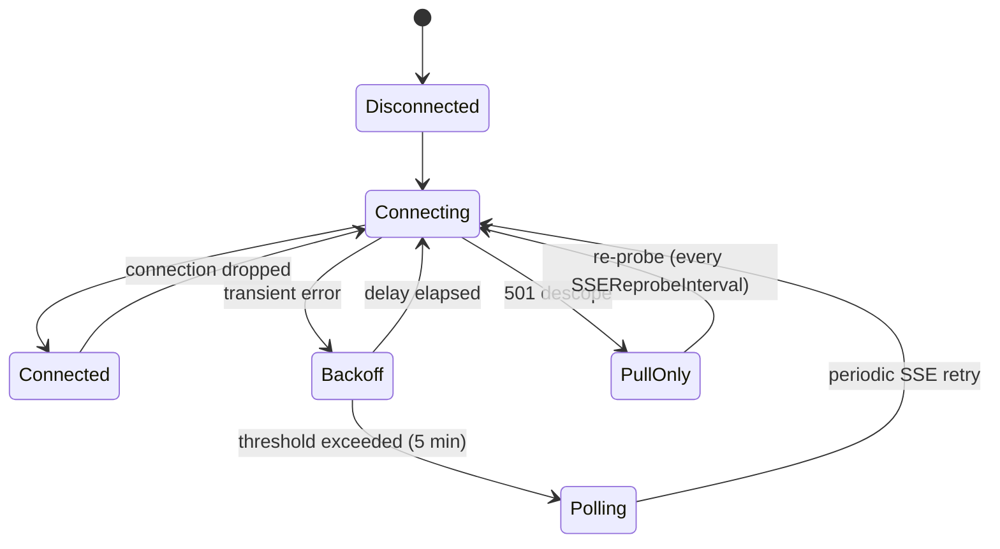

# Control Plane Client

The `internal/api` package provides the Go client for communicating with the Plexsphere control plane. It handles HTTPS request/response calls, SSE event streaming, automatic reconnection with exponential backoff, and event dispatching.

## Config

`Config` holds connection parameters passed to the client constructor. No file I/O occurs in this package — config loading is the caller's responsibility.

| Field                   | Type            | Default | Description                                    |
|-------------------------|-----------------|---------|------------------------------------------------|
| `BaseURL`               | `string`        | —       | Control plane API base URL (required)          |
| `TLSInsecureSkipVerify` | `bool`          | `false` | Disable TLS certificate verification           |
| `ConnectTimeout`        | `time.Duration` | `10s`   | TCP connection timeout                         |
| `RequestTimeout`        | `time.Duration` | `30s`   | Full HTTP request/response timeout             |
| `SSEIdleTimeout`        | `time.Duration` | `90s`   | Max idle time before SSE reconnect (now honored) |
| `SSEReprobeInterval`    | `time.Duration` | `10m`   | How often pull-only delivery re-probes a descoped SSE endpoint |

```go
cfg := api.Config{
    BaseURL:               "https://api.plexsphere.com",
    TLSInsecureSkipVerify: false,
}
cfg.ApplyDefaults() // sets zero-valued timeouts to defaults
if err := cfg.Validate(); err != nil {
    log.Fatal(err)
}
```

## ControlPlane

`ControlPlane` is the core HTTP client. It manages authentication, JSON serialization, gzip compression, and error mapping.

### Constructor

```go
func NewControlPlane(cfg Config, version string, logger *slog.Logger) (*ControlPlane, error)
```

- Applies config defaults and validates
- Configures TLS, connect timeout, request timeout
- Sets `User-Agent: plexd/{version}` on all requests
- Gzip-compresses request bodies larger than 1 KiB
- Transparently decompresses gzip responses

### Authentication

```go
client.SetAuthToken("node-identity-token")
```

Thread-safe via `sync.RWMutex`. The token is injected as `Authorization: Bearer {token}` on every request. Call `SetAuthToken` after registration to switch from bootstrap token to node identity token.

### API Methods

All methods accept a `context.Context` for cancellation and return typed responses.

| Method                | HTTP            | Path                                              | Request Type         | Response Type         |
|-----------------------|-----------------|---------------------------------------------------|----------------------|-----------------------|
| `Register`            | `POST`          | `/v1/register`                                    | `RegisterRequest`    | `*RegisterResponse`   |
| `Heartbeat`           | `POST`          | `/v1/nodes/{node_id}/heartbeat`                   | `HeartbeatRequest`   | `*HeartbeatResponse`  |
| `FetchState`          | `GET`           | `/v1/nodes/{node_id}/state`                       | —                    | `*NodeStateSnapshot`  |
| `ConnectSSE`          | `GET`           | `/v1/nodes/{node_id}/events`                      | —                    | `*http.Response`      |
| `RotateKeys`          | `POST`          | `/v1/keys/rotate`                                 | `KeyRotateRequest`   | `*KeyRotateResponse`  |
| `UpdateCapabilities`  | `PUT`           | `/v1/nodes/{node_id}/capabilities`                | `CapabilitiesPayload`| —                     |
| `ReportEndpoint`      | `PUT`           | `/v1/nodes/{node_id}/endpoint`                    | `EndpointRequest`    | `*EndpointResponse`   |
| `FetchSecret`         | `GET`           | `/v1/nodes/{node_id}/secrets/{name}` (optional `?version=N`) | —          | `*SecretEnvelope`     |
| `PutStateReport`      | `PUT`           | `/v1/nodes/{node_id}/state/reports/{key}`          | `NodeStateReportRequest` | `*NodeStateReportResponse` |
| `DeleteStateReport`   | `DELETE`        | `/v1/nodes/{node_id}/state/reports/{key}`          | —                    | — (`204 No Content`)  |
| `ExecutionCallback`   | `POST`          | `/v1/nodes/{node_id}/executions/{execution_id}`    | `ExecutionCallbackRequest` | `*ExecutionCallbackResponse` |
| `UploadExecutionOutput` | `PUT`         | presigned URL (no bearer token)                    | `[]byte`             | —                     |
| `ReportMetrics`       | `POST`          | `/v1/nodes/{node_id}/metrics`                     | `[]MetricSample` (JSON array) | `*IngestReceipt`   |
| `ReportLogs`          | `POST`          | `/v1/nodes/{node_id}/logs`                        | `[]LogLine` (NDJSON)  | `*IngestReceipt`      |
| `ReportAudit`         | `POST`          | `/v1/nodes/{node_id}/audit`                       | `[]AuditEvent` (NDJSON)| `*IngestReceipt`     |
| `ReportSessionActivity` | `POST`        | `/v1/nodes/{node_id}/sessions/{session_id}`        | `SessionActivityRequest` | — (`204 No Content`) |
| `ReportIntegrityViolation` | `POST`     | `/v1/nodes/{node_id}/integrity/violations`         | `IntegrityViolationReport` | —              |

### Generic Helpers

```go
func (c *ControlPlane) PostJSON(ctx context.Context, path string, body any, result any) error
func (c *ControlPlane) GetJSON(ctx context.Context, path string, result any) error
```

## Error Types

HTTP errors are mapped to structured `*APIError` values supporting `errors.Is` and `errors.As`.

| Sentinel           | Status | Description                          |
|--------------------|--------|--------------------------------------|
| `ErrBadRequest`    | 400    | Invalid request                      |
| `ErrUnauthorized`  | 401    | Authentication failure               |
| `ErrForbidden`     | 403    | Access denied (permanent)            |
| `ErrNotFound`      | 404    | Resource not found (permanent)       |
| `ErrConflict`      | 409    | Conflict                             |
| `ErrPayloadTooLarge`| 413   | Request body too large               |
| `ErrRateLimit`     | 429    | Rate limited (has `RetryAfter`)      |
| `ErrServer`        | 5xx    | Server error (matches any 5xx)       |

```go
resp, err := client.FetchState(ctx, nodeID)
if errors.Is(err, api.ErrUnauthorized) {
    // re-authenticate
} else if errors.Is(err, api.ErrRateLimit) {
    var apiErr *api.APIError
    errors.As(err, &apiErr)
    time.Sleep(apiErr.RetryAfter)
}
```

## SSEManager

`SSEManager` is the top-level orchestrator that wires together SSE streaming, reconnection, verification, and event dispatching.

### Lifecycle

```go
logger := slog.Default()
mgr := api.NewSSEManager(client, nil, logger) // nil verifier = NoOpVerifier

// Register handlers before Start
mgr.RegisterHandler("node_state_updated", func(ctx context.Context, env api.Envelope) error {
    // request a reconcile — the state pull is authoritative
    return nil
})
mgr.RegisterHandler("policy_updated", func(ctx context.Context, env api.Envelope) error {
    // handle policy change
    return nil
})

// Start blocks until context cancelled, Shutdown called, or permanent error
ctx, cancel := context.WithCancel(context.Background())
go func() {
    if err := mgr.Start(ctx, nodeID); err != nil {
        log.Printf("SSE manager stopped: %v", err)
    }
}()

// Later: graceful shutdown
mgr.Shutdown()
```

### Methods

| Method                 | Description                                                    |
|------------------------|----------------------------------------------------------------|
| `NewSSEManager`        | Creates manager with client, optional verifier, logger         |
| `RegisterHandler`      | Registers an event handler by type (call before `Start`)       |
| `Start(ctx, nodeID)`   | Blocking SSE loop with automatic reconnection                  |
| `Shutdown()`           | Cancels internal context, causes `Start` to return             |
| `SetPollFunc(fn)`      | Overrides the default polling function (`FetchState`)          |
| `SetReconnectIntervals`| Configures backoff base and max intervals                      |
| `SetPollingFallback`   | Configures polling fallback threshold and interval             |
| `SetIdleTimeout(d)`    | Sets the SSE idle timeout used for connections opened by `Start` |
| `SetReprobeInterval(d)`| Sets how often pull-only mode re-probes the SSE endpoint (non-positive ignored) |
| `SetReconcileTrigger(t)`| Sets the trigger fired once after every successful SSE connect to cover replay gaps |
| `Mode()`               | Returns the current `DeliveryMode` (`streaming`, `pull_only`, `degraded_polling`) |
| `SetOnModeChange(fn)`  | Registers a callback invoked on every delivery-mode transition |

## EventVerifier

Pluggable interface for verifying signed event envelopes. The default `NoOpVerifier` accepts all events; the production `Ed25519Verifier` checks the signature.

```go
type EventVerifier interface {
    Verify(ctx context.Context, envelope Envelope) error
}
```

`Ed25519Verifier` is keyed by signing key id: it is built from the registration-persisted `signing_key_id`/`signing_public_key` and selects the verifying key by the envelope's `key_id`. The current key id is always accepted; a previous key id is accepted only during the rotation grace window (until `transition_expires`). The `signing_key_rotated` event installs a new current key via `Rotate`. See [Event Verification](event-verification.md) for the full envelope shape, canonical form, staleness window, and rotation rules.

## EventDispatcher

Routes verified events to registered handlers by the envelope's `type`.

- Multiple handlers per event type (invoked sequentially in registration order)
- Handler errors are logged but do not block subsequent handlers
- Unhandled event types are logged at debug level and discarded
- Thread-safe handler registration via `sync.RWMutex`

## Event Type Constants

The SSE event set is organized in two tiers. Payloads of the reconcile-driving
types are opaque: the reconciler's state pull is authoritative, so those events
only request a reconcile.

**Contract** — currently emitted by the control plane per the OpenAPI events document:

| Constant                   | Value                   | Dispatch target                             |
|----------------------------|-------------------------|---------------------------------------------|
| `EventNodeStateUpdated`    | `node_state_updated`    | `TriggerReconcile()`                        |
| `EventPolicyUpdated`       | `policy_updated`        | `policy.HandlePolicyUpdated` → reconcile    |
| `EventBridgeConfigUpdated` | `bridge_config_updated` | `bridge.HandleBridgeConfigUpdated` → reconcile |
| `EventActionRequest`       | `action_request`        | `TriggerReconcile()`                        |
| `EventSessionSetup`        | `session_setup`         | `TriggerReconcile()`                        |

`action_request` carries no dispatch of its own: action executions are delivered
in the `executions` block of the state pull, so the event only pulls the next
reconcile forward and the resulting pull carries the dispatch. `session_setup` is
the same optimisation for mediated access: the session is delivered in the
`sessions` block of that pull, and the event only pulls it forward.

**Documented-coming** — named now so the agent can subscribe once the platform's 14-type taxonomy starts emitting them:

| Constant                   | Value                   | Dispatch target             |
|----------------------------|-------------------------|-----------------------------|
| `EventPeerRegistered`      | `peer_registered`       | `TriggerReconcile()`        |
| `EventPeerPSKAssigned`     | `peer_psk_assigned`     | `TriggerReconcile()`        |
| `EventPeerDeregistered`    | `peer_deregistered`     | `TriggerReconcile()`        |
| `EventPeerEndpointChanged` | `peer_endpoint_changed` | `TriggerReconcile()`        |
| `EventPeerKeyRotated`      | `peer_key_rotated`      | `TriggerReconcile()`        |
| `EventRotateKeys`          | `rotate_keys`           | key rotator's `RotateNow`   |
| `EventSigningKeyRotated`   | `signing_key_rotated`   | `Ed25519Verifier.Rotate`    |
| `EventSessionRevoked`      | `session_revoked`       | `TriggerReconcile()`        |

`session_revoked` carries no teardown of its own: a session leaving the `sessions`
block of the state pull is what closes it, so the event only pulls the observing
reconcile forward.

## ReconnectEngine

Manages SSE reconnection with exponential backoff and polling fallback.

### Backoff Parameters

| Parameter       | Default | Description                           |
|-----------------|---------|---------------------------------------|
| Base interval   | 1s      | Initial backoff delay                 |
| Multiplier      | 2x      | Exponential growth factor             |
| Max interval    | 60s     | Backoff cap                           |
| Jitter          | ±25%    | Random variation on each delay        |
| Polling fallback| 5 min   | Time before switching to polling      |
| Poll interval   | 60s     | How often to poll during fallback     |

### Failure Classification

| Error Type                                | Action                                          |
|-------------------------------------------|-------------------------------------------------|
| Network / 5xx                             | `RetryTransient` — exponential backoff          |
| 401 Unauthorized                          | `RetryAuth` — invoke callback, stop             |
| 429 Rate Limited                          | `RespectServer` — use Retry-After header        |
| 403 / 404                                 | `PermanentFailure` — stop reconnection          |
| 501 `signed_event_bus_not_provisioned`    | `RetryDescoped` — switch to pull-only delivery  |

A 501 carrying `signed_event_bus_not_provisioned` is classified ahead of the generic 5xx match: it is a durable descope of the event stream, not a transient error, so it is answered by pull-only delivery rather than backoff. A 501 with any other code, a 503 `event_stream_unavailable`, and network errors stay on the transient path.

### Delivery Modes

`SSEManager.Mode()` reports which channel currently delivers control-plane state, and `SetOnModeChange` fires on every transition:

| Mode               | Meaning                                                                                     |
|--------------------|---------------------------------------------------------------------------------------------|
| `streaming`        | The SSE event stream is attached and live.                                                  |
| `pull_only`        | The event stream is descoped (`RetryDescoped`). The engine stops polling entirely; the reconciler's own loop is the delivery channel, and SSE is re-probed once per `SSEReprobeInterval` (default 10m). |
| `degraded_polling` | The legacy transient fallback: after 5 minutes of failing SSE, the engine polls state every 60s while re-probing SSE. |

On a descope the engine enters `pull_only` immediately, with no backoff and no 5-minute polling-fallback window. A successful re-probe returns to `streaming` and resets backoff. During pull-only re-probes, auth failures and 403/404 still propagate as permanent; any other error keeps the engine in pull-only at the re-probe cadence.

### Reconnect-Triggered Pull and Cursor Reset

The server replays only sequences strictly greater than the client's `Last-Event-ID` cursor and never backfills an absent cursor. The client covers gaps itself: `SetReconcileTrigger` fires exactly one `TriggerReconcile()` after every successful SSE connect (HTTP 200). On a 400 while a cursor was set, the stream clears the cursor so the next connect tails from now — the reconcile pull covers the gap. The cursor is in-memory only, so a restart tails from now and the reconciler's first cycle covers the gap.

### State Machine



## SSE Parser

W3C-compliant `text/event-stream` line protocol parser.

- Handles `event:`, `data:`, `id:`, `retry:` fields
- Multi-line `data:` fields concatenated with `\n`
- Comment lines (`:` prefix) ignored (used as keepalives)
- Tracks `Last-Event-ID` for reconnection replay
- `retry:` field updates reconnection interval via callback

## SSE Stream

`SSEStream` wraps the parser with HTTP connectivity, envelope parsing, verification, and dispatching.

- Connects via `ControlPlane.ConnectSSE` with `Accept: text/event-stream`
- Sends `Last-Event-ID` header on reconnection
- Parses each `data:` payload as an `Envelope`
- Passes envelope through `EventVerifier` before dispatching
- Dispatches on the verified envelope's `type`, not the frame's `event:` field
- Malformed events are logged and skipped without disconnecting
