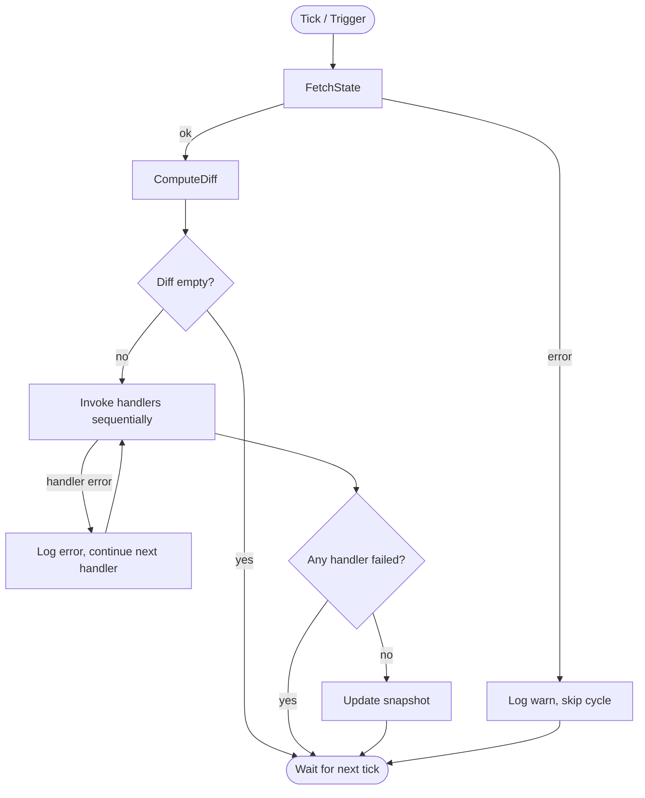

# Configuration Reconciliation

The `internal/reconcile` package implements the core convergence loop that keeps every node aligned with desired state. It periodically fetches the `NodeStateSnapshot` envelope from the control plane, computes a diff against a local snapshot, and invokes pluggable handlers to converge local state toward the envelope.

The pull is one-way: plexd does not report drift corrections back to the control plane. `POST /v1/nodes/{node_id}/drift` no longer exists. Applied-correction visibility will return as node-authored state reports (issue #23).

The envelope carries six always-present blocks — `peers`, `reachability`, `policy`, `bridge`, `state`, and `reports`. A `null` block means "not populated" rather than "field absent", so the differ compares by presence: a `null` block and a populated block are distinct states, and switching between them drives convergence.

## Config

`Config` holds reconciliation parameters passed to the `Reconciler` constructor. No file I/O occurs in this package.

| Field      | Type            | Default | Description                        |
|------------|-----------------|---------|------------------------------------|
| `Interval` | `time.Duration` | `60s`   | Time between reconciliation cycles |

```go
cfg := reconcile.Config{
    Interval: 30 * time.Second,
}
cfg.ApplyDefaults() // sets Interval to 60s if zero
if err := cfg.Validate(); err != nil {
    log.Fatal(err) // rejects negative or sub-second intervals
}
```

## StateFetcher

Interface for control plane communication. `*api.ControlPlane` satisfies this interface. It is narrowed to the single pull method; there is no drift-report counterpart.

```go
type StateFetcher interface {
    FetchState(ctx context.Context, nodeID string) (*api.NodeStateSnapshot, error)
}
```

## ReconcileHandler

Function type invoked when drift is detected. Each handler receives the full desired snapshot and the computed diff.

```go
type ReconcileHandler func(ctx context.Context, desired *api.NodeStateSnapshot, diff StateDiff) error
```

Handlers are invoked sequentially in registration order. Errors and panics in one handler do not prevent subsequent handlers from running.

## Reconciler

### Constructor

```go
func NewReconciler(client StateFetcher, cfg Config, logger *slog.Logger) *Reconciler
```

- Applies config defaults via `cfg.ApplyDefaults()`
- Initializes an empty state snapshot
- Creates a buffered trigger channel (size 1) for coalescing

### Methods

| Method             | Signature                                                   | Description                                        |
|--------------------|-------------------------------------------------------------|----------------------------------------------------|
| `RegisterHandler`  | `(handler ReconcileHandler)`                                | Adds a handler invoked on drift (call before `Run`) |
| `TriggerReconcile` | `()`                                                        | Requests immediate cycle; rapid calls are coalesced |
| `Run`              | `(ctx context.Context, nodeID string) error`                | Blocking loop; returns `ctx.Err()` on cancellation |

### Lifecycle

```go
logger := slog.Default()

client, _ := api.NewControlPlane(apiCfg, "1.0.0", logger)
client.SetAuthToken(identity.NodeSecretKey)

r := reconcile.NewReconciler(client, reconcile.Config{}, logger)

// Register handlers before Run
r.RegisterHandler(func(ctx context.Context, desired *api.NodeStateSnapshot, diff reconcile.StateDiff) error {
    // apply WireGuard peer changes
    return nil
})
r.RegisterHandler(func(ctx context.Context, desired *api.NodeStateSnapshot, diff reconcile.StateDiff) error {
    // apply network policy changes
    return nil
})

// Run blocks until context cancelled
ctx, cancel := context.WithCancel(context.Background())
go func() {
    if err := r.Run(ctx, nodeID); err != nil && err != context.Canceled {
        logger.Error("reconciler failed", "error", err)
    }
}()

// Trigger immediate reconciliation (e.g., after SSE reconnection)
r.TriggerReconcile()

// Graceful shutdown
cancel()
```

### Reconciliation Cycle

Each cycle follows this sequence:



1. **FetchState** — `GET /v1/nodes/{node_id}/state` via `StateFetcher`, returning the `NodeStateSnapshot` envelope
2. **ComputeDiff** — compare the desired snapshot against the local snapshot
3. **Skip if empty** — no handlers invoked
4. **Invoke handlers** — each handler called with panic recovery, in registration order
5. **Update snapshot** — only if every handler succeeded; a single handler failure holds the snapshot back so the same diff re-fires next cycle until it converges

### Error Handling

| Error Source       | Behavior                                              |
|--------------------|-------------------------------------------------------|
| `FetchState` error | Logged at warn, tick skipped, loop continues          |
| Handler error      | Logged at error, other handlers still run, snapshot held back |
| Handler panic      | Recovered with stack trace, treated as error          |
| Context cancelled  | `Run` returns `ctx.Err()` immediately                |

### Logging

All log entries use structured keys with `component=reconcile`:

| Key              | Description                          |
|------------------|--------------------------------------|
| `component`      | Always `"reconcile"`                 |
| `node_id`        | Node identifier                      |
| `interval`       | Configured reconciliation interval   |
| `drift`          | Compact `diff.Summary()`, e.g. `"peers+1-0~2 policy bridge state reports"` (or `"none"`) |
| `duration`       | Cycle execution time                 |
| `handler_failed` | Whether any handler returned error   |
| `error`          | Error details (on warn/error levels) |

## StateDiff

Describes the drift between the desired and current `NodeStateSnapshot`. Peer changes are enumerated; the four block flags are presence-aware, so a `null` block and a populated block are distinct.

```go
type StateDiff struct {
    PeersToAdd    []api.SnapshotPeer
    PeersToRemove []string           // node IDs
    PeersToUpdate []api.SnapshotPeer // peers with changed fields

    PolicyChanged  bool
    BridgeChanged  bool
    StateChanged   bool
    ReportsChanged bool
}
```

### ComputeDiff

```go
func ComputeDiff(desired, current *api.NodeStateSnapshot) StateDiff
```

Comparison logic by block:

| Block   | Match Key         | Detection                                                                 |
|---------|-------------------|---------------------------------------------------------------------------|
| Peers   | `SnapshotPeer.NodeID` | Add/remove by node ID; update when `MeshIP`, `PublicKey`, or `FallbackEndpoint` differs |
| Policy  | —                 | Presence-aware; when both blocks are populated it compares **only** the `Fingerprint` byte-for-byte |
| Bridge  | —                 | Presence-aware; both populated → `reflect.DeepEqual`                       |
| State   | —                 | Presence-aware; both populated → `reflect.DeepEqual`                       |
| Reports | —                 | Presence-aware; both populated → `reflect.DeepEqual`                       |

The policy `Fingerprint` is a 44-char base64 SHA-256 that the server computes over its canonical rule stream. plexd treats it as an opaque comparison key and **never re-derives it from the rules**: a revision-only bump (same fingerprint, new `revision_id`) or any rule-array difference that keeps the fingerprint equal is **not** a change, so the ruleset rebuild short-circuits. `reachability` is the node's own health projection, not desired state, so it is never diffed or stored.

### Summary

```go
func (d StateDiff) Summary() string
```

Returns a compact description of the diff for the cycle log, e.g. `"peers+1-0~2 policy bridge state reports"`. Only changed parts are mentioned; an empty diff returns `"none"`. It is logged under the `drift` key.

### IsEmpty

```go
func (d StateDiff) IsEmpty() bool
```

Returns `true` when all peer slices are empty and all four block flags are `false`.

## StateSnapshot

In-memory cache of the last known desired state, protected by `sync.RWMutex`.

| Method                                         | Description                                     |
|------------------------------------------------|-------------------------------------------------|
| `NewStateSnapshot() *stateSnapshot`            | Creates empty snapshot                          |
| `Get() api.NodeStateSnapshot`                  | Returns a deep copy of the current snapshot     |
| `Update(desired *api.NodeStateSnapshot)`       | Atomically replaces all blocks (deep copy)      |

All methods deep-copy data to prevent aliasing between snapshot and caller. `reachability` is not desired state, so `Get` always returns it as `nil` and `Update` never stores it.

> Drift reporting has been removed. There is no `BuildDriftReport`, `DriftReport`, or `DriftCorrection`, and `POST /v1/nodes/{node_id}/drift` does not exist upstream. Node-authored state reports (issue #23) will carry applied-correction visibility instead.

## Integration Points

### SSE Reconnection

When `SSEManager` reconnects after a disconnection, call `TriggerReconcile()` to catch up on missed events:

```go
// In the SSE reconnection callback
reconciler.TriggerReconcile()
```

### Heartbeat Reconcile Flag

When a heartbeat response contains `reconcile: true`, trigger an immediate cycle:

```go
resp, err := client.Heartbeat(ctx, nodeID, req)
if err == nil && resp.Reconcile {
    reconciler.TriggerReconcile()
}
```

### Registered Handlers

The agent registers these handlers (in `cmd/plexd/cmd/up.go`):

| Handler                          | Responsibility                                                        |
|----------------------------------|----------------------------------------------------------------------|
| `nodeapi` cache handler          | Feed the local state cache from the snapshot `state` block           |
| `wireguard.ReconcileHandler`     | Apply peer add/remove/update from the `peers` block (registered only when the WireGuard interface came up) |
| `policy.ReconcileHandler`        | Rebuild the nftables ruleset from the merged `policy` block on a fingerprint change |
| bridge sub-handlers              | Reconcile relay, user-access, ingress, and site-to-site subtrees      |

Signing-key rotation is no longer a reconcile handler: key material comes from registration and the `signing_key_rotated` SSE event.
