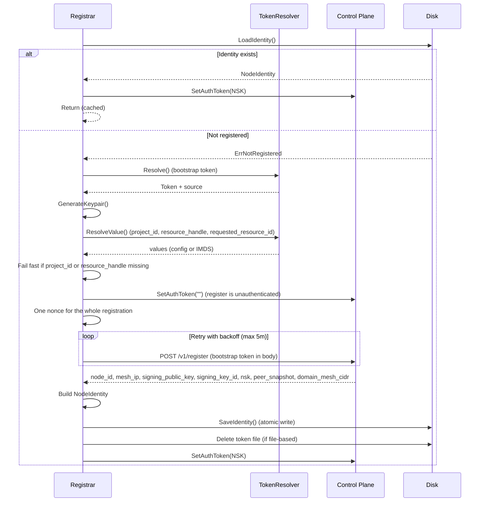

# Registration

The `internal/registration` package handles node self-registration and bootstrap authentication with the Plexsphere control plane. It resolves a one-time bootstrap token, generates a Curve25519 keypair, registers with the control plane, persists the resulting identity, and manages auth token lifecycle.

## Config

`Config` holds registration parameters passed to the `Registrar` constructor. Config loading is the caller's responsibility.

| Field                             | Type            | Default                        | Description                                |
|-----------------------------------|-----------------|--------------------------------|--------------------------------------------|
| `DataDir`                         | `string`        | —                              | Data directory for identity files (required)|
| `ProjectID`                       | `string`        | —                              | Platform project UUID to register into (required for fresh registration)|
| `ResourceHandle`                  | `string`        | —                              | Platform Resource handle to bind to (required for fresh registration)|
| `RequestedResourceID`             | `string`        | —                              | Optional resource ID override when substrate naming differs from the handle|
| `TokenFile`                       | `string`        | `/etc/plexd/bootstrap-token` (Linux) | Path to bootstrap token file ([per platform](configuration.md#platform-defaults)) |
| `TokenEnv`                        | `string`        | `PLEXD_BOOTSTRAP_TOKEN`        | Environment variable for bootstrap token   |
| `TokenValue`                      | `string`        | —                              | Direct token value override                |
| `UseMetadata`                     | `bool`          | `false`                        | Enable cloud metadata source for registration inputs|
| `MetadataTokenPath`               | `string`        | `/plexd/bootstrap-token`       | Metadata key path for bootstrap token      |
| `MetadataTimeout`                 | `time.Duration` | `2s`                           | Timeout for metadata service requests      |
| `MaxRetryDuration`                | `time.Duration` | `5m`                           | Maximum retry duration for transient errors|

```go
cfg := registration.Config{
    DataDir: "/var/lib/plexd",
}
cfg.ApplyDefaults() // sets TokenFile, TokenEnv, the metadata paths, MetadataTimeout, MaxRetryDuration
if err := cfg.Validate(); err != nil {
    log.Fatal(err) // DataDir is required
}
```

`Validate` only enforces `DataDir`. `ProjectID` and `ResourceHandle` are
required inputs but are validated at fresh-registration time, not during config
parsing: if either is missing, `Register` fails before any HTTP call with an
error naming the config key, CLI flag, and environment variable.

## TokenResolver

Resolves the bootstrap token by checking sources in priority order. The first non-empty result wins.

### Source Priority

1. **Direct value** — `Config.TokenValue`
2. **File** — `Config.TokenFile` (content trimmed of whitespace)
3. **Environment variable** — `os.Getenv(Config.TokenEnv)` (trimmed)
4. **Metadata service** — via `MetadataProvider` interface (only if `Config.UseMetadata` is true)

### Token Validation

- Non-empty
- Maximum 512 bytes
- Printable ASCII only (bytes 0x20–0x7E)

### TokenResult

| Field      | Type     | Description                                    |
|------------|----------|------------------------------------------------|
| `Value`    | `string` | The resolved token value                       |
| `FilePath` | `string` | Non-empty if token was read from a file        |

`FilePath` is used by the `Registrar` to delete the token file after successful registration.

```go
resolver := registration.NewTokenResolver(&cfg, nil) // nil = no metadata provider
result, err := resolver.Resolve(ctx)
if err != nil {
    // error lists all attempted sources
}
```

### MetadataProvider

Pluggable interface for cloud-specific value resolution. A single call reads one
value (bootstrap token, project ID, resource handle, or requested resource ID)
from the metadata service at the given path.

```go
type MetadataProvider interface {
    ReadValue(ctx context.Context, path string) (string, error)
}
```

The concrete implementation `IMDSProvider` reads the value at any metadata path
from cloud instance metadata services (IMDSv2 with IMDSv1 fallback). See [Cloud-Init Deployment Reference](../deployment/cloud-init-deployment.md) for details.

`ResolveValue` layers config over metadata for `project_id`, `resource_handle`,
and `requested_resource_id`: a non-empty direct config value always wins;
otherwise, when `UseMetadata` is `true`, the value at the corresponding
metadata path is read. A path the metadata service does not serve
(`ErrMetadataNotFound`) means "not provisioned" and yields an empty string, so
optional inputs stay optional. Every other read error is returned — a transient
IMDS failure must not be reported as a missing config setting.

`plexd up` and `plexd join` attach an `IMDSProvider` automatically when
`use_metadata` is `true`; no wiring is required to provision registration
inputs through instance metadata.

## GenerateKeypair

Generates a Curve25519 keypair for WireGuard mesh encryption.

- Private key: 32 random bytes from `crypto/rand`, clamped per Curve25519 spec
- Public key: derived via `curve25519.X25519(privateKey, Basepoint)`
- Private key never leaves the node and is never logged

```go
keypair, err := registration.GenerateKeypair()
if err != nil {
    log.Fatal(err)
}
pubKeyBase64 := keypair.EncodePublicKey() // standard base64, 44 characters
```

### Keypair

| Field        | Type     | Description                     |
|--------------|----------|---------------------------------|
| `PrivateKey` | `[]byte` | 32-byte clamped Curve25519 key  |
| `PublicKey`  | `[]byte` | 32-byte derived public key      |

## NodeIdentity

Holds the registration identity of a node after successful enrollment.

| Field              | Type     | JSON Tag             | Persisted To            |
|--------------------|----------|----------------------|-------------------------|
| `NodeID`           | `string` | `"node_id"`          | `identity.json`         |
| `MeshIP`           | `string` | `"mesh_ip"`          | `identity.json`         |
| `SigningPublicKey`  | `string` | `"signing_public_key"`| `identity.json` + `signing_public_key` |
| `SigningKeyID`     | `string` | `"signing_key_id"`   | `identity.json`         |
| `DomainMeshCIDR`   | `string` | `"domain_mesh_cidr"` | `identity.json`         |
| `PrivateKey`       | `[]byte` | `"-"` (excluded)     | `private_key` (base64)  |
| `NodeSecretKey`    | `string` | `"-"` (excluded)     | `node_secret_key`       |

`SigningKeyID` is the key id used for rotation-aware verification of control
plane signatures (e.g. `did:web:plexsphere.com#key-2026-04`); `DomainMeshCIDR`
is the domain mesh address range (e.g. `100.64.0.0/10`). Both are read from the
`POST /v1/register` response. Legacy `identity.json` files written before these
keys existed still load — the missing fields decode as empty strings.

### Data Directory Layout

```
{data_dir}/
├── identity.json        (0600) — NodeID, MeshIP, SigningPublicKey, SigningKeyID, DomainMeshCIDR
├── private_key          (0600) — base64-encoded Curve25519 private key
├── node_secret_key      (0600) — NSK (standard base64); source of the bearer envelope
└── signing_public_key   (0600) — control plane signing public key
```

- Directory created with `0700` permissions if missing
- All files written atomically (temp file + fsync + rename)
- `PrivateKey` and `NodeSecretKey` use `json:"-"` tags to prevent accidental JSON serialization

### BearerToken

Assembles the `Authorization` bearer credential the control plane admits on
every post-registration call:

```
nsk_<env>_<base64url(node_id_bytes(16) || nsk_plaintext_bytes(32))>
```

The payload is exactly 48 bytes — the node's UUID followed by the decoded
NSK — encoded with unpadded base64url; plexd stamps `plexd` as the `<env>`
segment, which the control plane treats as informational. The raw base64 NSK
string is never presented as a bearer; the control plane refuses it with
`401`. Both registrar paths (fresh registration and resuming a persisted
identity) arm the shared API client with this envelope, and an identity whose
`node_id` is not a canonical UUID cannot form it — the registrar treats such
an identity like corrupt identity files and re-registers.

```go
bearer, err := identity.BearerToken()
```

### SaveIdentity / LoadIdentity

```go
// Persist after registration
err := registration.SaveIdentity("/var/lib/plexd", identity)

// Load on restart
identity, err := registration.LoadIdentity("/var/lib/plexd")
if errors.Is(err, registration.ErrNotRegistered) {
    // no identity files — need to register
}
```

## ErrNotRegistered

Sentinel error returned by `LoadIdentity` when identity files are absent from the data directory.

```go
var ErrNotRegistered = errors.New("registration: node is not registered")
```

Supports `errors.Is` matching:

```go
if errors.Is(err, registration.ErrNotRegistered) {
    // proceed with fresh registration
}
```

## Registrar

Orchestrates the complete registration lifecycle: check existing identity, resolve token, generate keypair, register with retries, persist identity, clean up token file, and set auth token.

### Constructor

```go
func NewRegistrar(client *api.ControlPlane, cfg Config, logger *slog.Logger) *Registrar
```

- Applies config defaults
- Logger tagged with `component=registration`
- Optional: call `SetMetadataProvider`, `SetClock` after construction (the
  `plexd up` / `plexd join` commands call `SetMetadataProvider` for you when
  `use_metadata` is enabled)

### Register

```go
func (r *Registrar) Register(ctx context.Context) (*NodeIdentity, error)
```

Orchestration flow:



1. **Load existing identity** — if valid, set auth token and return (idempotent)
2. **Corrupt identity** — log warning, proceed with fresh registration
3. **Resolve bootstrap token** — via `TokenResolver.Resolve`
4. **Generate Curve25519 keypair**
5. **Resolve registration inputs** — `project_id`, `resource_handle`, and `requested_resource_id` via `ResolveValue` (direct config value, else IMDS). Each required input is checked as soon as it resolves, so a missing `project_id` fails before the later metadata lookups run
6. **Fail fast** — return an error before any HTTP call if `project_id` or `resource_handle` is empty
7. **Clear the auth token** — `client.SetAuthToken("")`. `POST /v1/register` is unauthenticated (`security: []`); the bootstrap token travels in the request body. Clearing also drops a stale NSK on the re-registration path. The previous token is restored unless registration completes, so a failed re-registration does not leave the shared client unauthenticated.
8. **POST /v1/register with retry** — one UUIDv4 nonce per logical registration, reused across attempts; exponential backoff on transient errors. The nonce is replay protection, not an idempotency key: a nonce the control plane has already recorded is answered with `403 nonce_collision`, so retrying a request that may already have been committed is denied rather than granted a second node. The nonce is never persisted — after a restart it could only produce that denial, so a fresh registration starts with a fresh nonce
9. **Build NodeIdentity** from response + private key — `nsk` must decode from standard-padded base64 to a 32-byte AES-256-GCM key, or registration fails before anything is persisted
10. **Persist identity** atomically to data directory
11. **Delete token file** if token was file-based (failure logged, not fatal)
12. **Set node_secret_key (nsk) as auth** — `client.SetAuthToken(nsk)`

### Retry Logic

The control plane returns errors as RFC 9457 `application/problem+json`. plexd
classifies each failure on its HTTP status and optional machine-readable `code`
member (via `api.ClassifyError`); unknown codes are tolerated. The bootstrap
token is **never consumed on an error branch** — a stopped or retried attempt
leaves the token spendable.

| Status | Problem `code`(s) | plexd behavior |
|--------|-------------------|----------------|
| `400` | `public_key_invalid` (or none) | Stop — invalid request |
| `401` | — | Stop — bootstrap token rejected |
| `403` | `kind_mismatch`, `project_mismatch`, `token_consumed`, `token_expired`, `token_revoked`, `nonce_collision` | Stop — terminal denial |
| `404` | `resource_not_found` | Stop — resource unresolved |
| `409` | — | Stop |
| `422` | — | Stop — invariant violation |
| `429` | — | Retry, honoring the `Retry-After` header |
| `503` | `pool_exhausted`, `subrange_exhausted`, `allocator_contention` | Retry with backoff |
| `500` | — | Retry with backoff |
| Network / transport error | — | Retry with backoff |

Backoff parameters (consistent with `internal/api/ReconnectEngine`):

| Parameter         | Value  |
|-------------------|--------|
| Base interval     | 1s     |
| Multiplier        | 2x     |
| Max interval      | 60s    |
| Jitter            | ±25%   |
| Timeout           | `Config.MaxRetryDuration` (default 5m) |

### IsRegistered

```go
func (r *Registrar) IsRegistered() bool
```

Returns `true` if valid identity files exist in `Config.DataDir`.

### Usage Example

```go
// Create control plane client
cpClient, err := api.NewControlPlane(api.Config{
    BaseURL: "https://api.plexsphere.com",
}, "1.0.0", slog.Default())
if err != nil {
    log.Fatal(err)
}

// Create registrar
reg := registration.NewRegistrar(cpClient, registration.Config{
    DataDir:        "/var/lib/plexd",
    ProjectID:      "0190a8b8-a0c0-7a0a-8a0a-a0a0a0a0a0a0",
    ResourceHandle: "edge-router-01",
}, slog.Default())

// Run registration (idempotent — skips if already registered)
identity, err := reg.Register(ctx)
if err != nil {
    log.Fatalf("registration failed: %v", err)
}

log.Printf("registered as %s with mesh IP %s", identity.NodeID, identity.MeshIP)
// Control plane client now has node_secret_key set as auth token
```

### Auth Token Lifecycle

| Phase                    | Auth Token Value        |
|--------------------------|-------------------------|
| Before registration      | Bootstrap token (resolved, not yet sent)|
| During POST /v1/register | none (unauthenticated; bootstrap token in body)|
| After registration       | `NodeSecretKey`         |
| On restart (cached)      | `NodeSecretKey` from disk|
